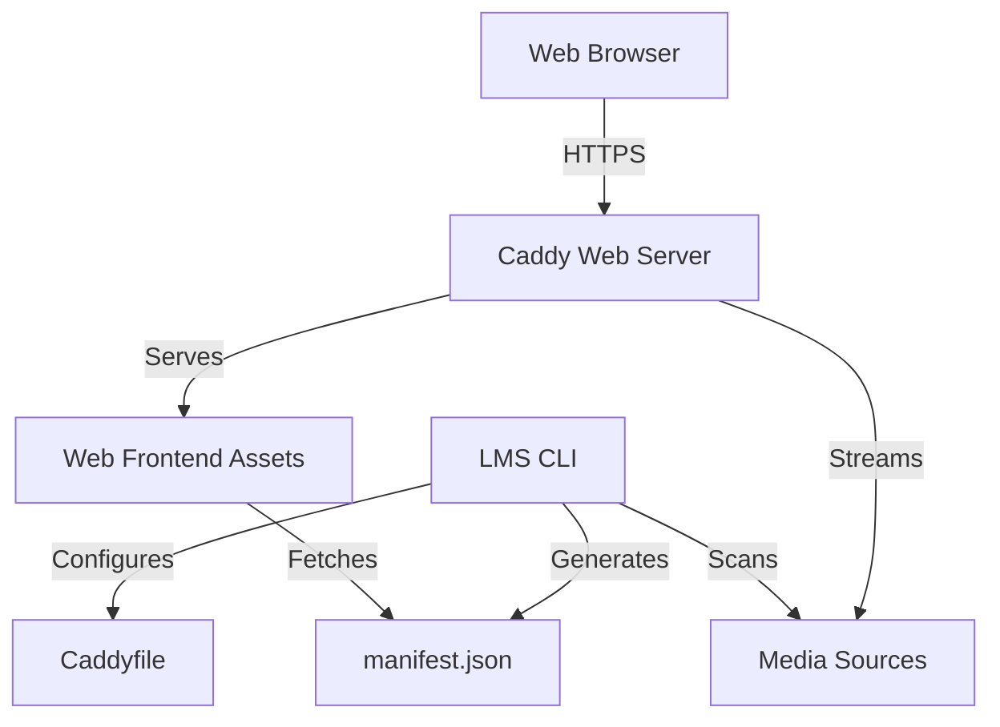

# LMS - Lime's Media Server

LMS (Lime's Media Server) is a professional, lightweight, and security-first self-hosted media server designed for high-performance delivery of movies, TV shows, and music. Built with a "less is more" philosophy, LMS leverages industry-standard tools like Caddy, Systemd, and Linux Access Control Lists (ACLs) to provide a robust streaming experience without the bloat of traditional media servers.

## Purpose of LMS

LMS was created for users who want complete control over their media library with minimal overhead. It avoids heavy database engines and complex background processes, instead utilizing a fast manifest-driven architecture. It provides a modern web interface for browsing and playing content while maintaining a strict security model that protects the host system.

## Main Features

- **Blazing Fast Frontend:** A clean, responsive web interface built with modern standards.
- **Security-First Design:** Runs as a restricted system user with granular ACL-based permissions.
- **Caddy Integration:** High-performance web serving with automatic HTTPS support and built-in security hardening.
- **Automated Metadata:** Intelligent scanning of media directories to generate a unified catalog.
- **Subtitles Support:** Automatic detection and serving of `.vtt` and `.srt` subtitle tracks.
- **Fail2ban Ready:** Integrated brute-force protection for the web interface.
- **Hardened Systemd Service:** Leverages modern Linux kernel security features for process isolation.

## Design Philosophy

LMS follows the Unix philosophy of doing one thing and doing it well.
- **Transparency:** No hidden databases; configuration is stored in human-readable JSON.
- **Performance:** Static asset delivery and streaming are handled by Caddy, ensuring peak efficiency.
- **Security:** Least-privilege access is enforced at the filesystem level.

## Supported Platforms

LMS is designed for Linux-based systems. It officially supports and includes automated installation logic for:
- **Debian / Ubuntu**
- **Arch Linux**
- **Fedora / RHEL**

## High-Level Architecture

LMS uses a decoupled architecture where management logic is separated from media delivery:



---

# Installation

LMS is designed to be installed on a dedicated Linux host or a home server.

## Requirements

### Supported Operating Systems
- Ubuntu 20.04+ / Debian 11+
- Arch Linux
- Fedora 34+

### Dependencies
LMS relies on the following industry-standard tools:
- **Python 3.8+**: Powering the CLI and manifest generation.
- **Caddy**: The high-performance web server and reverse proxy.
- **ACL (Access Control Lists)**: For fine-grained filesystem permissions.
- **FFmpeg**: Used for extracting media metadata and durations.
- **Fail2ban**: (Optional) For automated brute-force protection.
- **Git**: For installation and updates.

### Hardware Recommendations
- **Minimum:** 1 vCPU, 512MB RAM (suitable for small libraries).
- **Recommended:** 2+ vCPUs, 2GB+ RAM (for large libraries and many concurrent users).
- **Storage:** LMS itself occupies < 100MB; media storage requirements depend on your library.

---

## Automated Installation

The official installation script automates the setup of the environment, dependencies, and security configuration.

```bash
curl -sSL https://raw.githubusercontent.com/EmilPtr/LMS/prod/install.sh | bash
```

### What the installer does:
1. **Dependency Management:** Automatically detects your OS and installs required packages (Caddy, Python, FFmpeg, etc.).
2. **Security Setup:** Creates a restricted `lms` system user with no login shell and no home directory.
3. **Application Setup:** Clones the production branch to `~/.lms` and configures a Python virtual environment.
4. **Environment Configuration:** Creates `/etc/lms.env` and sets up a global `lms` command in `/usr/local/bin`.
5. **Filesystem Hardening:** Applies Linux ACLs to allow the `lms` user to traverse your home directory and read media files without changing their ownership.
6. **System Integration:** Generates and enables a hardened Systemd service unit.

### Finalizing Setup
After the script completes, you must initialize your installation:

1. **Initialize the server:**
   ```bash
   lms init
   ```
   Follow the prompts to create your admin credentials and add your first media source.

2. **Start the service:**
   ```bash
   sudo systemctl start lms
   ```

---

## Manual Installation

For advanced users who prefer manual configuration:

1. **Clone the repository:**
   ```bash
   git clone --branch prod https://github.com/EmilPtr/LMS.git ~/.lms
   cd ~/.lms
   ```

2. **Set up Python Environment:**
   ```bash
   python3 -m venv venv
   ./venv/bin/pip install -r requirements.txt
   ```

3. **Configure Environment:**
   Add `export LMS_HOME="$HOME/.lms"` to your `.bashrc` or `.zshrc`.

4. **Initialize:**
   ```bash
   ./venv/bin/python main.py init
   ```

5. **Configure Caddy & Systemd:**
   Use the LMS CLI to generate the necessary configuration files:
   ```bash
   lms config setup-systemd
   lms config setup-fail2ban
   ```

---

# Command Reference

The `lms` command is your primary tool for managing the server.

| Command | Syntax | Description |
| :--- | :--- | :--- |
| **init** | `lms init` | Starts the interactive setup wizard. |
| **generate** | `lms generate` | Scans sources and regenerates the media manifest. |
| **config info** | `lms config info` | Displays system status and configuration paths. |
| **add-source** | `lms config add-source <name> <path>` | Adds a media directory and applies permissions. |
| **remove-source** | `lms config remove-source <name>` | Removes a media source and its associated ACLs. |
| **set-password** | `lms config set-password <pass> [user]` | Updates web authentication credentials. |
| **remove-password**| `lms config remove-password` | Disables authentication for the web interface. |
| **setup-systemd** | `lms config setup-systemd` | Generates and offers to install the Systemd service. |
| **setup-fail2ban** | `lms config setup-fail2ban` | Generates and installs Fail2ban security filters. |

---

# Usage Guide

LMS provides a streamlined experience for end-users:

1. **Accessing the Interface:** Open your browser and navigate to your server's IP (default port 80).
2. **Authentication:** Enter the username and password created during `lms init`.
3. **Browsing:** Choose between **Movies**, **TV Shows**, or **Music** from the home screen.
4. **Playback:** Click on any title to open the dedicated player. The player supports seek, volume control, and subtitle selection.
5. **Search:** Use the search bar in each library section to find specific content instantly.

---

# Media Sources

LMS uses a "Source" model to organize media. A source is a root directory on your filesystem that LMS is authorized to read.

### Recommended Media Organization
LMS expects a specific directory structure within your sources to identify content correctly:

```text
Media_Source_Root/
├── Movies/
│   ├── Movie Name (Year).mkv
│   ├── Another Movie.mp4
│   └── Thumbnails/
│       ├── Movie Name (Year).jpg
│       └── Another Movie.png
├── Shows/
│   ├── Show Name/
│   │   ├── thumbnail.jpg
│   │   ├── S01/
│   │   │   ├── Episode 01.mkv
│   │   │   └── Episode 02.mkv
│   │   └── S02/
│   │       └── E01.mp4
└── Music/
    ├── Album Name/
    │   ├── cover.jpg
    │   ├── 01 - Song Name.mp3
    │   └── 02 - Song Name.flac
```

### Metadata Identification
- **Movies:** Identified by filename. Thumbnails must be in the `Thumbnails/` subfolder and match the movie filename exactly.
- **TV Shows:** Each show is a folder. Seasons must be named `S01`, `S02`, etc. Episodes are sorted alphabetically within season folders.
- **Music:** Each album is a folder containing a `cover.jpg` or `cover.png` and audio files.
- **Subtitles:** Automatically detected if they share the same base name as the video file (e.g., `Movie.mkv` and `Movie.en.vtt`). Supported formats: `.vtt`, `.srt`.

---

# File Structure

LMS maintains a strict separation between application files and your media content.

- **Installation Directory (`LMS_HOME`):** Defaults to `~/.lms`. Contains the application logic, frontend assets, and virtual environment.
- **`config.json`:** Stores your configured sources and authentication details.
- **`Caddyfile`:** The runtime configuration for the web server.
- **`web/manifest.json`:** The generated catalog of your media.
- **`log/`:** Contains `access.log`, used by Fail2ban to monitor for unauthorized access attempts.
- **`cache/`:** Internal storage for session and temporary data.

**Note:** Your media remains in its original location. LMS only requires read-access via ACLs, ensuring your library is never modified or moved by the application.

---

# Security Architecture

LMS is built with a defense-in-depth security model.

## Dedicated Service User
The application does not run as your primary user or as root. It runs as a dedicated `lms` system user. This user has:
- **No login shell:** Cannot be used to log into the system.
- **No home directory:** Minimizing the attack surface.
- **Minimal Permissions:** Only has the permissions explicitly granted via ACLs.

## Filesystem Permissions (ACLs)
LMS uses Linux Access Control Lists (ACLs) to manage access without complex group memberships:
- **Traversal Permissions:** The `lms` user is granted `+x` (execute) on parent directories to reach the media, but cannot list files in those parents.
- **Read-Only Access:** Media sources are granted `rx` (read/execute) permissions. LMS cannot delete or modify your media files.
- **Inheritance:** Default ACLs are set on the `log` and `cache` directories so new files created by the server are automatically accessible by the service account.

## Caddy Integration
Caddy acts as the secure gateway for LMS:
- **HTTPS:** Ready for automatic TLS via Let's Encrypt.
- **Least Privilege:** Caddy is configured to reject any non-GET/HEAD requests to media and static assets, preventing unauthorized write operations.
- **LAN Exemption:** Basic auth is automatically bypassed for local network connections (e.g., 192.168.x.x) for convenience, while remaining mandatory for external access.

## Systemd Service Hardening
The `lms.service` unit file includes several security directives:
- `CapabilityBoundingSet=CAP_NET_BIND_SERVICE`: Allows binding to port 80/443 without root.
- `NoNewPrivileges=true`: Prevents the process from gaining new privileges.
- `ProtectSystem=full`: Makes `/usr`, `/boot`, and `/etc` read-only for the service.
- `PrivateTmp=true`: Sets up a private `/tmp` directory.

---

# Configuration

### Environment Variables
- `LMS_HOME`: The absolute path to the LMS installation. This is required for the CLI to function.

### Configuration Files
- **`config.json`**:
  - `sources`: Mapping of source names to filesystem paths.
  - `username`: Admin username for the web interface.
  - `password_hash`: Secure bcrypt hash for Caddy authentication.

---

# Troubleshooting

### Service fails to start
Check the logs using journalctl:
```bash
sudo journalctl -u lms -f
```

### Permission Denied errors
Ensure the `lms` user has permission to reach your media. You can verify ACLs with `getfacl`:
```bash
getfacl /path/to/your/media
```
If permissions are missing, run `lms config add-source` again to re-apply them.

### Media not appearing
1. Ensure your files follow the [Media Organization](#media-sources) guide.
2. Run `lms generate` to update the manifest.
3. Check the CLI output for any `[WARN]` or `[ERROR]` messages during scanning.

---

# Development Guide

### Setup Development Environment
1. Clone the repository.
2. Install development dependencies:
   ```bash
   pip install -r requirements.txt
   ```
3. Set `LMS_HOME` to your local clone.
4. Run the backend directly:
   ```bash
   python3 main.py help
   ```

### Repository Structure
- `main.py`: CLI Entry point.
- `config.py`: Configuration and system integration logic.
- `gen_manifest.py`: Media scanning engine.
- `paths.py`: Path management.
- `web/`: Vanilla JavaScript/HTML frontend.
- `install.sh`: Production installer.
