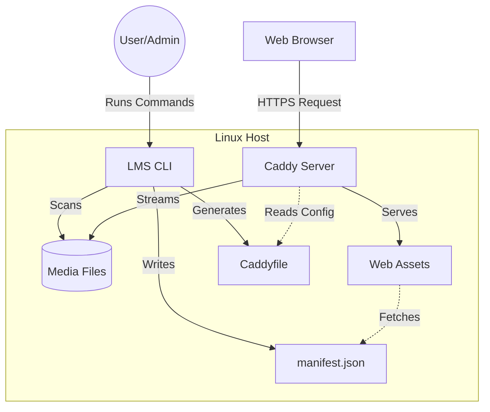

<p align="center">
  
</p>

# LMS - Lime's Media Server

LMS (Lime's Media Server) is a self-hosted media server for movies, TV shows, and music. It uses Caddy for web serving, Systemd for service management, and Linux Access Control Lists (ACLs) for permission handling.

## Overview

LMS provides a web interface for browsing and playing media content from configured local directories. It uses a manifest-based architecture to catalog media without a traditional database engine.

### Core Features
- **Web Interface:** Responsive frontend for media browsing and playback.
- **Security Model:** Runs as a restricted system user with ACL-based filesystem access.
- **Web Server:** Integrated Caddy configuration with automatic HTTPS support.
- **Metadata Scanning:** Automated scanning of media directories to generate `manifest.json`.
- **Subtitles:** Support for `.vtt` and `.srt` subtitle tracks.
- **Security Integration:** Pre-configured Fail2ban filters and hardened Systemd service unit.

## Architecture

LMS uses a decoupled architecture where the management CLI handles configuration and cataloging, while Caddy handles high-performance media delivery.



---

# Installation

## Requirements

### Operating Systems
- Ubuntu 20.04+ / Debian 11+
- Arch Linux
- Fedora 34+

### Dependencies
- **Python 3.8+**: CLI and manifest generation.
- **Caddy**: Web server and reverse proxy.
- **ACL**: Filesystem permission management.
- **FFmpeg**: Metadata extraction.
- **Fail2ban**: (Optional) Brute-force protection.
- **Git**: Installation and updates.

---

## Automated Installation

The `install.sh` script automates dependency installation and system configuration.

```bash
curl -sSL https://raw.githubusercontent.com/EmilPtr/LMS/prod/install.sh | bash
```

### Installation Steps:
1. **Packages:** Installs required system dependencies via the native package manager.
2. **User:** Creates a restricted `lms` system user (no login, no home directory).
3. **Environment:** Clones the repository to `~/.lms` and creates a Python virtual environment.
4. **CLI:** Creates a global `lms` command in `/usr/local/bin`.
5. **Permissions:** Applies ACLs to allow the `lms` user to read media directories.
6. **Service:** Installs and enables the `lms.service` Systemd unit.

### Finalization
After the script completes, you must initialize and configure the server:

1. **Initialize:** `lms init` (creates admin user and first media source).
2. **Setup Systemd:** `lms config setup-systemd`
3. **Setup Fail2ban:** `lms config setup-fail2ban`
4. **Start Service:** `sudo systemctl start lms`

---

## Manual Installation

1. **Clone Repository:**
   ```bash
   git clone --branch prod https://github.com/EmilPtr/LMS.git ~/.lms
   cd ~/.lms
   ```
2. **Python Setup:**
   ```bash
   python3 -m venv venv
   ./venv/bin/pip install -r requirements.txt
   ```
3. **Environment:** Set `LMS_HOME="$HOME/.lms"` in your shell configuration.
4. **Initialization:** `./venv/bin/python main.py init`
5. **System Integration:**
   ```bash
   lms config setup-systemd
   lms config setup-fail2ban
   ```

---

# Command Reference

| Command | Syntax | Description |
| :--- | :--- | :--- |
| **init** | `lms init` | Interactive setup wizard. |
| **generate** | `lms generate` | Scans sources and updates `manifest.json`. |
| **config info** | `lms config info` | Displays system status and paths. |
| **add-source** | `lms config add-source <name> <path>` | Adds media directory and applies ACLs. |
| **remove-source** | `lms config remove-source <name>` | Removes media source and associated ACLs. |
| **set-password** | `lms config set-password <pass> [user]` | Updates authentication credentials. |
| **remove-password**| `lms config remove-password` | Disables web interface authentication. |
| **setup-systemd** | `lms config setup-systemd` | Generates/installs Systemd service unit. |
| **setup-fail2ban** | `lms config setup-fail2ban` | Generates/installs Fail2ban filters. |

---

# Media Sources

### Directory Structure
LMS requires the following structure within media sources:

```text
Source_Root/
├── Movies/
│   ├── Movie Name (Year).mkv
│   └── Thumbnails/
│       └── Movie Name (Year).jpg
├── Shows/
│   ├── Show Name/
│   │   ├── thumbnail.jpg
│   │   └── S01/
│   │       └── Episode 01.mkv
└── Music/
    └── Album Name/
        ├── cover.jpg
        └── 01 - Song Name.mp3
```

### Identification Logic
- **Movies:** Files in `Movies/`. Thumbnails in `Movies/Thumbnails/` must match filename.
- **TV Shows:** Show folder > Season folder (`S01`, `S02`) > Episode files.
- **Music:** Album folder > `cover.jpg/png` + audio files.
- **Subtitles:** `.vtt` or `.srt` files matching the video filename (e.g., `Movie.mkv` and `Movie.en.vtt`).

---

# Security Architecture

### Service User
The application runs as the `lms` system user, which has no login shell and no home directory.

### Filesystem Permissions (ACLs)
- **Traversal:** `lms` user is granted `+x` on parent directories of media sources.
- **Read-Only:** Media sources are granted `rx` access.
- **Inheritance:** `log/` and `cache/` directories use default ACLs to ensure service user access to new files.

### Caddy Configuration
- **Access Control:** Rejects non-GET/HEAD requests for media and static assets.
- **Authentication:** Basic Auth is enforced for external connections; bypassed for local network ranges (e.g., 192.168.0.0/16).
- **Logging:** Structured access logs are stored in `log/access.log` for Fail2ban monitoring.

### Systemd Hardening
`lms.service` includes:
- `CapabilityBoundingSet=CAP_NET_BIND_SERVICE`
- `NoNewPrivileges=true`
- `ProtectSystem=full`
- `PrivateTmp=true`

---

# Configuration

- **`LMS_HOME`**: Environment variable pointing to the installation root.
- **`config.json`**:
  - `sources`: Media source mapping.
  - `username`: Admin username.
  - `password_hash`: Bcrypt hash for Caddy authentication.
- **`Caddyfile`**: Web server configuration, generated by the CLI.

---

# Troubleshooting

### Check Service Status
```bash
sudo systemctl status lms
sudo journalctl -u lms -f
```

### Verify Permissions
```bash
getfacl /path/to/media
```

### Media Missing
1. Validate directory structure matches the [Media Sources](#media-sources) guide.
2. Run `lms generate` to update the manifest.
3. Review CLI output for scanning errors.

---

# Development

### Local Setup
1. `pip install -r requirements.txt`
2. Set `LMS_HOME` to the repository root.
3. Use `python3 main.py` for CLI operations.

### Repository Structure
- `main.py`: CLI Entry point.
- `config.py`: Configuration and system integration.
- `gen_manifest.py`: Media scanning logic.
- `paths.py`: Path definitions.
- `web/`: Frontend assets.
- `install.sh`: Installer script.
